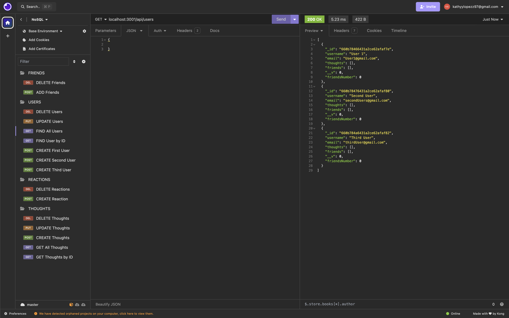

# NoSQL-Social-Network-API

[](https://opensource.org/licenses/MIT)

  
## NoSQL-Social-Network-API

## User Story
```
AS A social media startup
I WANT an API for my social network that uses a NoSQL database
SO THAT my website can handle large amounts of unstructured data
```

## Acceptance Criteria
```
GIVEN a social network API
WHEN I enter the command to invoke the application
THEN my server is started and the Mongoose models are synced to the MongoDB database
WHEN I open API GET routes in Insomnia for users and thoughts
THEN the data for each of these routes is displayed in a formatted JSON
WHEN I test API POST, PUT, and DELETE routes in Insomnia
THEN I am able to successfully create, update, and delete users and thoughts in my database
WHEN I test API POST and DELETE routes in Insomnia
THEN I am able to successfully create and delete reactions to thoughts and add and remove friends to a user’s friend listatabase

```
## Table of Contents

- [Description](#description)
- [Links](#links)
- [Installation](#installation)
- [Usage](#usage)
- [Credits](#credits)
- [Contact me](#contact-me)


  
## Description
Overview of NoSQL-Social-Network-API, NOSQL uses mongodb compass to store data and use social network apis to create users, ,friends, thoughts , and reactions. Thus, it helps collect data by id using express.js and mongoose in NOSQL database.
## Links
- [The URL of Github Repository](https://github.com/kathylopez97/NoSQL-Social-Network-API)
- [Youtube Video Walkthrough](https://www.youtube.com/watch?v=YmSfREvrzdU)

## Installation 

Instructions on how to use


1. Clone the repo
   ```
   git clone git@github.com:kathylopez97/NoSQL-Social-Network-API.git
   ```
2. Install NPM packages

   ```
   npm i 
   ```
   ```
   Install express
   ```
   ```
   Install mongoose
   ```

5. Run Server
   ```
   node server.js
   ```
6. Use Insomina 
## Usage
 


## Build with 

- 
- 
## Credits 
- Youtube: [Youtube](https://youtube.com)
- Visual Studio Code: [VS Code](https://code.visualstudio.com/)
- Professional README Guide: [README.md](https://coding-boot-camp.github.io/full-stack/github/professional-readme-guide)
- Professional  Video Guide Submisson: [VideoGuide](https://coding-boot-camp.github.io/full-stack/computer-literacy/video-submission-guide)


## Contact me
<!-- I hope you all like it! -->


Contact me If you have any questions or additional feedback.
- [Github](https://github.com/kathylopez97)
- [Email](kathyylopezz97@gmail.com)
